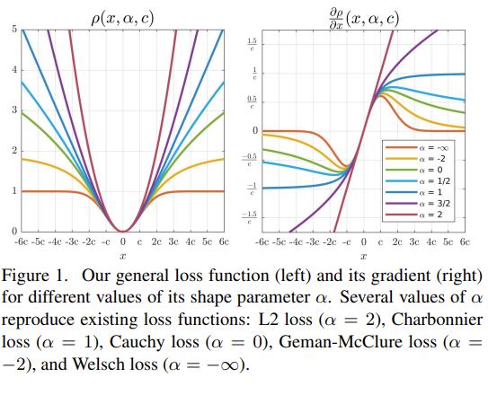

# Robust Losses
<!-- Replace with the actual path to your image -->

## Introduction
This project introduces a generalized loss function designed to encompass a broad range of popular loss functions used in optimization and machine learning. Specifically, the loss function implemented here is a superset of the following commonly used functions:

- Welsch/Leclerc
- Geman-McClure
- Cauchy/Lorentzian
- Generalized Charbonnier
- Charbonnier/pseudo-Huber/L1-L2
- L2

Each of these functions can be adopted for tasks where balancing sensitivity to outliers and numerical stability is critical.

## Intuition

The loss robust loss function with α = 2 corresponds to estimating a mean, with α = 1 to estimating a median, and with α approaching −∞ to local mode-finding. In between, intermediate values of α provide a smooth transition between these types of averages in the estimation process.




## Regression Loss Features
- Unified Loss Function: A single implementation to capture diverse loss behaviors.
- Configurable Parameters: Adjust weights and constants to shift between loss behaviors.
- Outlier Management: Controls for outlier influence by choosing the appropriate loss configuration.

## Installation
Clone this repository and install the necessary dependencies:

```bash
git clone <repository_url>
cd <project_directory>
install your favorite version of torch :)
```
## Usage
### Loss Function Overview
The following parameters allow you to customize the loss function:

- Parameter alpha - is a shape parameter that controls the robustness of the loss (less is more)
- Parameter c - is a scale parameter that controls the size of the loss’s quadratic bowl near x = 0 (larger equals reducing loss)

### Example Code
```
# Import the loss function
from loss_module import GeneralizedLossFunction

# Initialize the loss function with parameters
loss = GeneralizedLossFunction(param_a=0.5, param_b=2.0)

# Compute the loss for an input tensor
output = loss(input_tensor, target_tensor)
```

## References
- Jonathan T. Barron. "A General and Adaptive Robust Loss Function"
